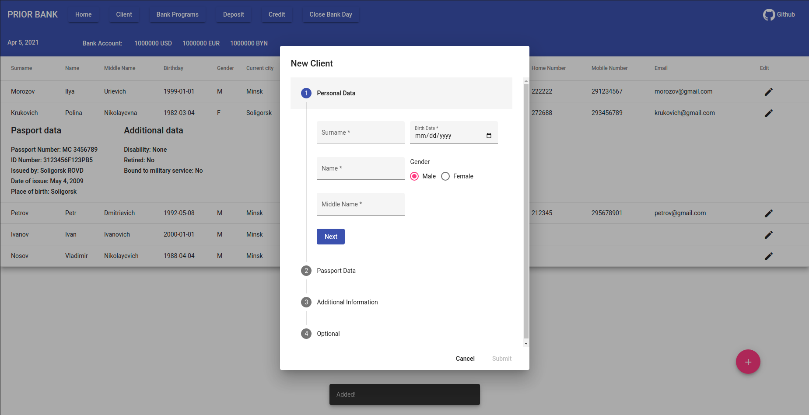
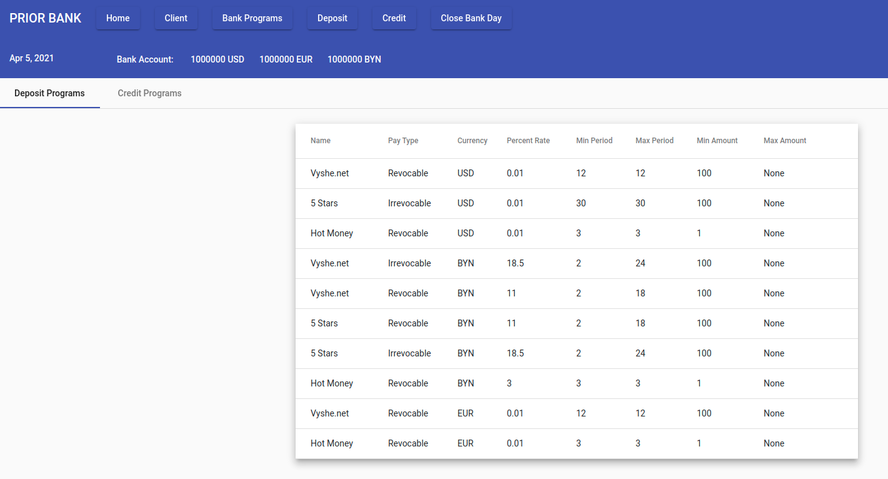
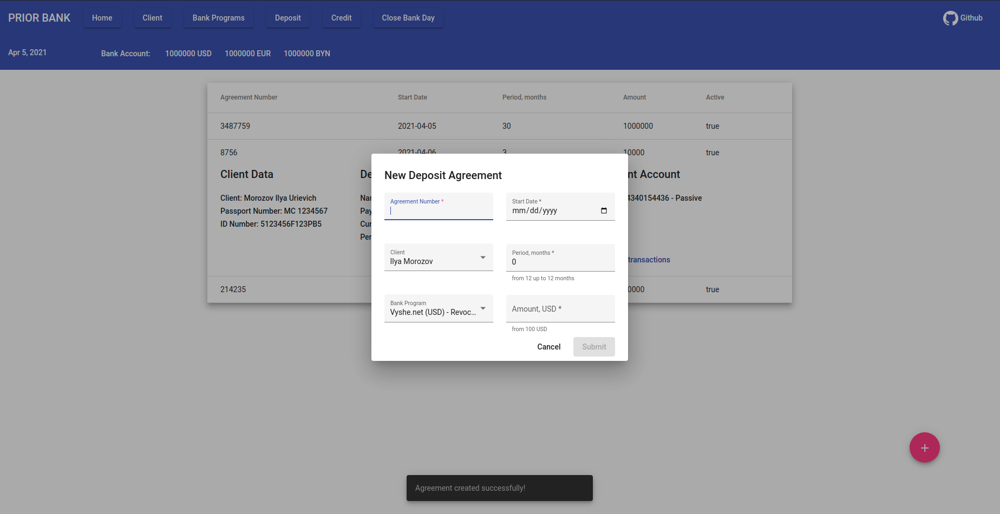
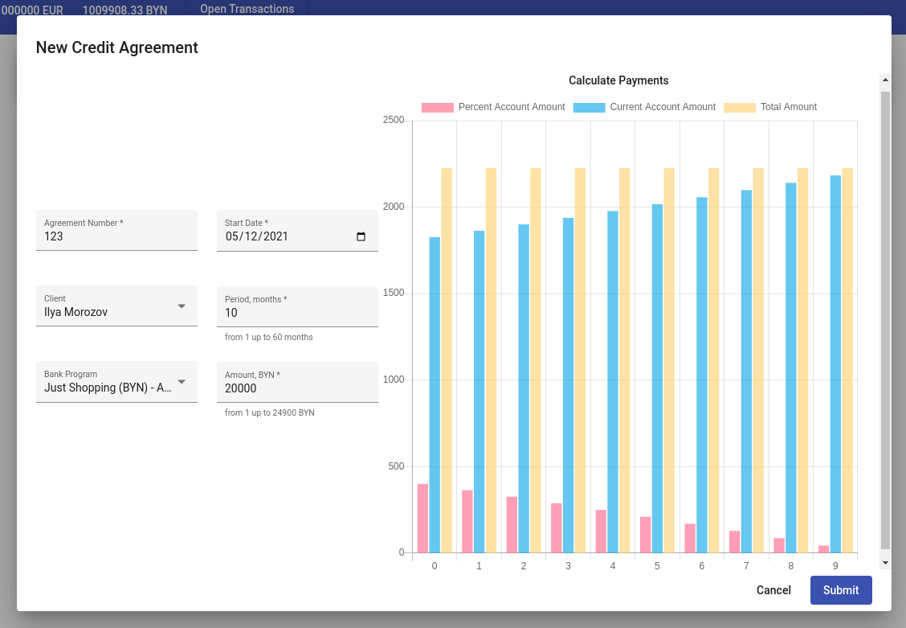
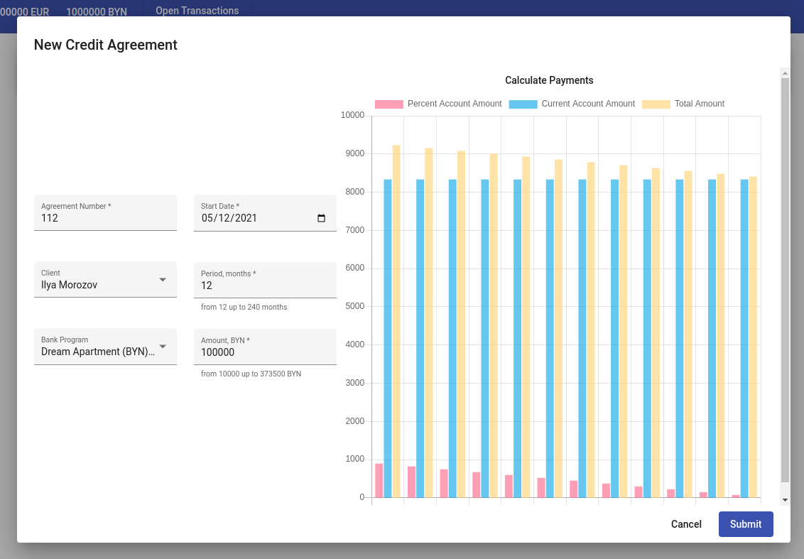

# Bank Management System :moneybag: :bank: :money_with_wings: 

### About :information_source:

Application to demonstrate basic bank operations.

- Clients management
- Deposit operations
- Credit operations
- Closing bank day

### Technology Stack

| Component            | Technology            |
| -------------------- | --------------------- |
| Front-End            | Angular 10            |
| Back-End             | Spring Boot (Java 11) |
| Database             | PostgreSQL            |
| Client Build Tools   | angular-cli, npm      |
| Server Build Tools   | Maven                 |
| Front-End Components | Angular Material      |

### Prerequisites :eyes:

Ensure you have this installed:

- Java 11
- Maven 
- Node.js
- npm
- angular-cli

#### Build Front-End 

```shell
# Navigate to the root folder (should contain package.json)
npm install

# Build the project (this will put the files under dist folder)
ng build

# Serve the application (usually http://localhost:4200)
ng serve
```

### Screenshots






